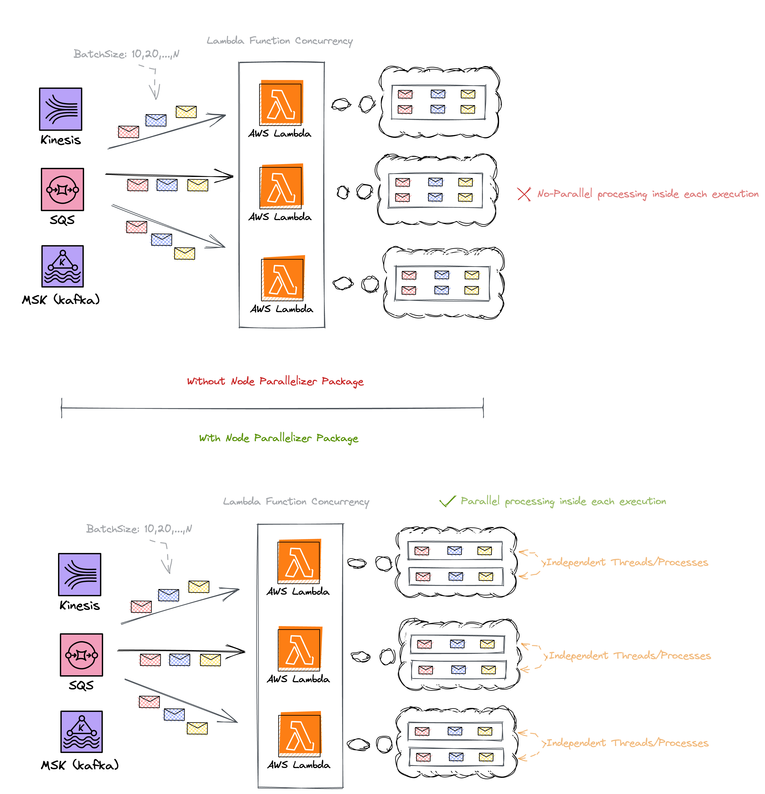

# Node Parallelizer
A NodeJS package for running code in parallel. Initially created to provide multiprocessing in an **AWS Lambda function**, but it can be used in any NodeJS environment.

## Supported parallelizers
- Child Process
- Worker threads

### Child Process Parallelizer
This parallelizer is specifically designed for processing hundreds or thousands of records in a single invocation when your code performs both CPU-intensive and **I/O-intensive operations**.

When you call the `runBatch(records)` method in this parallelizer, the package will split the list of records you provide into smaller subsets, and your code will be used to execute each subset in parallel.

It uses the NodeJS [child process module](https://nodejs.org/api/child_process.html) behind the scenes.

### Worker Threads Parallelizer
This parallelizer is specifically designed for processing hundreds or thousands of records in a single invocation when your code performs **CPU-intensive operations**.

When you call the `runBatch(records)` method in this parallelizer, the package will split the list of records you provide into smaller subsets, and your code will be used to execute each subset in parallel.

It uses the NodeJS [worker threads module](https://nodejs.org/api/worker_threads.html) behind the scenes.

## AWS Lambda & Node Parallelizer
This package can detect the number of vCPU cores allocated to your Lambda function and maximize their utilization. By default, it generates one child process/thread per vCPU core, but this setting can be customized to meet your specific requirements. Alternatively, you can manually specify the number of child processes/threads the library creates, regardless of the number of vCPU cores available.

It uses the Lambda function environment `/tmp` folder to create the required module that runs in the child.

On the Child Process Parallelizer, when you call the `parallelizerFunction` method outside of the Lambda handler function, it will reuse the child processes across the different invocations within a Lambda instance, minimazing the impact of creating child process on every invocation. Furthermore, if the package detects a disconnection of any of the child processes, it will recreate it automatically without affecting the execution.

## Demostration


## Benchmark
```bash
$ node test/benchmark.js
Child Parallelizer x 12.79 ops/sec
Thread Parallelizer x 12.51 ops/sec
Without Parallelizer x 2.75 ops/sec

Result: 
Fastest is Child Parallelizer,Thread Parallelizer
Slowest is Without Parallelizer
```
## Installation
```bash
npm i node-parallelizer --save
```
## Usage
<details>
  <summary>Parallelizer (<b>CPU-intensive operations && I/O-intensive operations</b>)</summary>

  #### Class instantiation
`Parallelizer({ type = 'child-process', tmpPath = '/tmp', maxParallelization = false, parallelizationPerCPU = 1, debug = false })`

**Parameters**
- `type` (String) (Default value: 'child-process') (Options: 'child-process' | 'worker-threads'): The parallelizer type to be used.
- `tmpPath` (String) (Default value: '/tmp'): The path where the module that runs in the thread will be created.
- `maxParallelization` (Number|false) (Default value: false): The maximum number of processes/threads that will be created. If false, it is based on the CPU cores available.
- `parallelizationPerCPU` (Number) (Default value: 1): If the `maxParallelization` is set to `false`, this parameter defines the amount of processes/threads per CPU.
- `debug` (Boolean) (Default value: false): Enables the internal logs for debuggin purposes.
#### Main methods
`parallelizerFunction({ filePath, processBatchFunctionName })`

**Parameters**
- `filePath` (String): The absolute path to the file that contains the function that will be executed in parallel.
- `processBatchFunctionName` (String): The name of the function that will be executed in parallel.

`runBatch(batch)`

**Parameters**
- `batch` (Array): The records you want to process in parallel.

**Returns** (Array): The thread's responses.
#### Using worker threads parallizer in AWS Lambda.
In this example, the repository structure looks like this
```
src/
  handler.js
  parallel.js
serverless.yml
package.json
```

The below snippet represents your Lambda handler
```javascript
// handler.js

const { Parallelizer, PARALLELIZER_CHILD, PARALLELIZER_THREADS } = require("node-parallelizer");

// Creates a new parallelizer instance.
const parallelizer = new Parallelizer();
// Creates child processes based on your code.
parallelizer.parallelizerFunction({ type: PARALLELIZER_CHILD, filePath: "/var/task/src/parallel.js", processBatchFunctionName: 'batchProcessor' });

module.exports.handler = async(event) => {
  // Run batch in parallel
  const responses = await parallelizer.runBatch(event.Records);
  
  console.log(responses);
};

```
> Make sure to provide the filePath parameter as an absolute path. In this example, we've included '/var/task/' prefix in the path because Lambda deploys your code within that folder.

The below snippet represents the code you want to run in parallel
```javascript
// parallel.js

const batchProcessor = ({ batch }) => {
  
  //
  // HERE YOUR CODE
  //

  return { success: true, count: batch.length }
}


module.exports = { batchProcessor }

```
> Verify that the input signature of your function (in this case, batchProcessor) includes batch as a parameter, as it contains the subset of records that a child process will handle.
  
</details>
<details>
  <summary>Child Process Parallelizer (<b>I/O-intensive operations or CPU-intensive operations && I/O-intensive operations</b>)</summary>

  #### Class instantiation
`ChildProcess({ tmpPath = '/tmp', maxParallelization = false, parallelizationPerCPU = 1, debug = false })`

**Parameters**
- `tmpPath` (String) (Default value: '/tmp'): The path where the module that runs in the child will be created.
- `maxParallelization` (Number|false) (Default value: false): The maximum number of child processes that will be created. If false, it is based on the CPU cores available.
- `parallelizationPerCPU` (Number) (Default value: 1): If the `maxParallelization` is set to `false`, this parameter defines the amount of processes per CPU.
- `debug` (Boolean) (Default value: false): Enables the internal logs for debuggin purposes.
#### Main methods
`parallelizerFunction({ filePath, processBatchFunctionName })`

**Parameters**
- `filePath` (String): The absolute path to the file that contains the function that will be executed in parallel.
- `processBatchFunctionName` (String): The name of the function that will be executed in parallel.

`runBatch(batch)`

**Parameters**
- `batch` (Array): The records you want to process in parallel.

**Returns** (Array): The child processes' responses.
#### Using child process parallizer in AWS Lambda.
In this example, the repository structure looks like this
```
src/
  handler.js
  parallel.js
serverless.yml
package.json
```

The below snippet represents your Lambda handler
```javascript
// handler.js

const { ChildProcess } = require("node-parallelizer");

// Creates a new child process instance.
const childProcess = new ChildProcess();
// Creates child processes based on your code.
childProcess.parallelizerFunction({ filePath: "/var/task/src/parallel.js", processBatchFunctionName: 'batchProcessor' });

module.exports.handler = async(event) => {
  // Run batch in parallel
  const responses = await childProcess.runBatch(event.Records);
  
  console.log(responses);
};

```
> Make sure to provide the filePath parameter as an absolute path. In this example, we've included '/var/task/' prefix in the path because Lambda deploys your code within that folder.

The below snippet represents the code you want to run in parallel
```javascript
// parallel.js

const batchProcessor = ({ batch }) => {
  
  //
  // HERE YOUR CODE
  //

  return { success: true, count: batch.length }
}


module.exports = { batchProcessor }

```
> Verify that the input signature of your function (in this case, batchProcessor) includes batch as a parameter, as it contains the subset of records that a child process will handle.
  
</details>
<details>
  <summary>Worker Threads Parallelizer (<b>CPU-intensive operations</b>)</summary>

  #### Class instantiation
`WorkerThreads({ tmpPath = '/tmp', maxParallelization = false, parallelizationPerCPU = 1, debug = false })`

**Parameters**
- `tmpPath` (String) (Default value: '/tmp'): The path where the module that runs in the thread will be created.
- `maxParallelization` (Number|false) (Default value: false): The maximum number of threads that will be created. If false, it is based on the CPU cores available.
- `parallelizationPerCPU` (Number) (Default value: 1): If the `maxParallelization` is set to `false`, this parameter defines the amount of threads per CPU.
- `debug` (Boolean) (Default value: false): Enables the internal logs for debuggin purposes.
#### Main methods
`parallelizerFunction({ filePath, processBatchFunctionName })`

**Parameters**
- `filePath` (String): The absolute path to the file that contains the function that will be executed in parallel.
- `processBatchFunctionName` (String): The name of the function that will be executed in parallel.

`runBatch(batch)`

**Parameters**
- `batch` (Array): The records you want to process in parallel.

**Returns** (Array): The thread's responses.
#### Using worker threads parallizer in AWS Lambda.
In this example, the repository structure looks like this
```
src/
  handler.js
  parallel.js
serverless.yml
package.json
```

The below snippet represents your Lambda handler
```javascript
// handler.js

const { WorkerThreads } = require("node-parallelizer");

// Creates a new child process instance.
const threads = new WorkerThreads();
// Creates child processes based on your code.
threads.parallelizerFunction({ filePath: "/var/task/src/parallel.js", processBatchFunctionName: 'batchProcessor' });

module.exports.handler = async(event) => {
  // Run batch in parallel
  const responses = await threads.runBatch(event.Records);
  
  console.log(responses);
};

```
> Make sure to provide the filePath parameter as an absolute path. In this example, we've included '/var/task/' prefix in the path because Lambda deploys your code within that folder.

The below snippet represents the code you want to run in parallel
```javascript
// parallel.js

const batchProcessor = ({ batch }) => {
  
  //
  // HERE YOUR CODE
  //

  return { success: true, count: batch.length }
}


module.exports = { batchProcessor }

```
> Verify that the input signature of your function (in this case, batchProcessor) includes batch as a parameter, as it contains the subset of records that a child process will handle.
  
</details>

## Examples

1. [Basic](https://github.com/Edujugon/node-parallelizer/tree/main/examples/basic)
2. [With Bundler](https://github.com/Edujugon/node-parallelizer/tree/main/examples/with-bundler/README.md)

## Contribution
We welcome contributions to this project. If you are interested in contributing, please feel free to submit a pull request.
