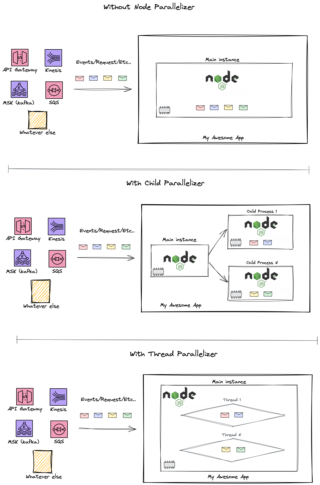

# Node Parallelizer
A NodeJS package for running code in parallel. Initially created to provide multiprocessing in an **AWS Lambda function**, but it can be used in any NodeJS environment.

## Supported parallelizers
- Child Process
- Worker threads

### Child Process Parallelizer
This parallelizer is designed specifically for creating new Node.js processes. These processes include an extra communication channel that enables message exchange between the parent and child processes.

Bear in mind that the created Node.js child processes are independent from the parent process, except for the IPC communication channel connecting them. Each child process has its own memory and V8 instance. Due to the extra resources required for these allocations, it is not advisable to create a large number of child Node.js processes.

It uses the NodeJS [child process module](https://nodejs.org/api/child_process.html) behind the scenes.

### Worker Threads Parallelizer
This parallelizer enables the use of threads that execute JavaScript in parallel.

These threads are beneficial for carrying out JavaScript tasks that demand significant CPU resources. However, they offer limited advantages for I/O-intensive tasks. Node.js's native asynchronous I/O operations or the the child process parallelizer are more effective than this parallelizer type in such cases.

It uses the NodeJS [worker threads module](https://nodejs.org/api/worker_threads.html) behind the scenes.

### Generic details
When you call the `run(records)` method in a parallelizer instance, this package will split the list of records you provide into smaller subsets, and your code will be used to execute each subset in parallel.

This package can detect the number of vCPU cores allocated to your execution environment and maximize their utilization. By default, it generates one child process/thread per vCPU core, but this setting can be customized to meet your specific requirements. Alternatively, you can manually specify the number of child processes/threads the library creates, regardless of the number of vCPU cores available.

## AWS Lambda & Node Parallelizer
By default, It uses the Lambda function environment `/tmp` folder to create the required module that runs in the child process/thread.

When you create an instance of the Child Process Parallelizer outside of the Lambda handler function, it will reuse the child processes across the different invocations within a Lambda instance, minimazing the impact of creating child process on every invocation. Furthermore, if the package detects a disconnection of any of the child processes, it will recreate it automatically without affecting the execution.

## Demostration


## Benchmark

#### CPU & I/O operations (Parallelization per CPU = 1)
```bash
$ node test/benchmark.js
Child Parallelizer x 15.08 ops/sec
Thread Parallelizer x 31.90 ops/sec
Without Parallelizer x 2.79 ops/sec

Result: 
Fastest is Thread Parallelizer
Slowest is Without Parallelizer
```

#### CPU & I/O operations (Parallelization per CPU = 3)
```bash
$ node test/benchmark.js
Child Parallelizer x 17.01 ops/sec
Thread Parallelizer x 7.72 ops/sec
Without Parallelizer x 2.93 ops/sec

Result: 
Fastest is Child Parallelizer
Slowest is Without Parallelizer
```

#### Child + Thread Parallelizers VS JavaScript Promise.All (Parallelization of = 1)
```bash
$ node test/benchmark-2.js
Child + Thread Parallelizers x 8.15 ops/sec
JavaSCript Promise.All x 7.21 ops/sec

Result: 
Fastest is Child and Thread Parallelizers
Slowest is JavaSCript Promise.All
```

#### Child + Thread Parallelizers VS JavaScript Promise.All (Parallelization of = 3)
```bash
$ node test/benchmark-2.js
Child + Thread Parallelizers x 16.42 ops/sec
JavaSCript Promise.All x 7.49 ops/sec

Result: 
Fastest is Child + Thread Parallelizers
Slowest is JavaSCript Promise.All
```
## Installation
```bash
npm i node-parallelizer --save
```

## Usage
<details>
  <summary>Parallelizer (Basic)</summary>

  #### Class instantiation
`Parallelizer({ type = 'child-process', tmpPath = '/tmp', filePath, processBatchFunctionName, parallelization = false, parallelizationPerCPU = 1, debug = false })`

**Parameters**
- `type` (String) (Default value: 'child-process') (Options: 'child-process' | 'worker-threads'): The parallelizer type to be used.
- `tmpPath` (String) (Default value: '/tmp'): The path where the module that runs in the thread will be created.
- `filePath` (String): The absolute path to the file that contains the function that will be executed in parallel.
- `processBatchFunctionName` (String): The name of the function that will be executed in parallel.
- `parallelization` (Number|false) (Default value: false): The exact number of processes/threads that will be created. If false, it is based on the CPU cores available.
- `parallelizationPerCPU` (Number) (Default value: 1): If the `parallelization` is set to `false`, this parameter defines the amount of processes/threads per CPU.
- `debug` (Boolean) (Default value: false): Enables the internal logs for debuggin purposes.
#### Main methods
`run(batch)`

**Parameters**
- `batch` (Array): The records you want to process in parallel.

**Returns** (Array): The processes/threads' responses.
#### Using the Node Parallizer in AWS Lambda.
In this example, the repository structure looks like this
```
src/
  handler.js
  parallel.js
serverless.yml
package.json
```

The below snippet represents your Lambda handler
```javascript
// handler.js

const { Parallelizer, PARALLELIZER_CHILD, PARALLELIZER_THREADS } = require("node-parallelizer");

// Creates a new parallelizer instance.
const parallelizer = new Parallelizer({ type: PARALLELIZER_CHILD, filePath: "/var/task/src/parallel.js", processBatchFunctionName: 'batchProcessor' });

module.exports.handler = async(event) => {
  // Run batch in parallel
  const responses = await parallelizer.run(event.Records);
  
  console.log(responses);
};

```
> Make sure to provide the filePath parameter as an absolute path. In this example, we've included '/var/task/' prefix in the path because Lambda deploys your code within that folder.

The below snippet represents the code you want to run in parallel
```javascript
// parallel.js

const batchProcessor = ({ batch }) => {
  
  //
  // HERE YOUR CODE
  //

  return { success: true, count: batch.length }
}


module.exports = { batchProcessor }

```
> Verify that the input signature of your function (in this case, batchProcessor) includes batch as a parameter, as it contains the subset of records that a child process will handle.
  
</details>

<details>
  <summary>Parallelizer (Advance)</summary>

  #### Class instantiation
`Parallelizer([{ id: "only-cpu", type = 'worker-threads', tmpPath = '/tmp', filePath, processBatchFunctionName, parallelization = false, parallelizationPerCPU = 1, debug = false }, { id: "only-io", type = 'child-process', tmpPath = '/tmp', filePath, processBatchFunctionName, parallelization = false, parallelizationPerCPU = 1, debug = false }])`

**Parameters**
- List of:
  - `id` (String): The unique identifier for your Child/Thread internal instance.
  - `type` (String) (Default value: 'child-process') (Options: 'child-process' | 'worker-threads'): The parallelizer type to be used.
  - `tmpPath` (String) (Default value: '/tmp'): The path where the module that runs in the thread will be created.
  - `filePath` (String): The absolute path to the file that contains the function that will be executed in parallel.
  - `processBatchFunctionName` (String): The name of the function that will be executed in parallel.
  - `parallelization` (Number|false) (Default value: false): The exact number of processes/threads that will be created. If false, it is based on the CPU cores available.
  - `parallelizationPerCPU` (Number) (Default value: 1): If the `parallelization` is set to `false`, this parameter defines the amount of processes/threads per CPU.
  - `debug` (Boolean) (Default value: false): Enables the internal logs for debuggin purposes.
#### Main methods
`run([{ id: "only-cpu", batch: batchOne },{ id: "only-io", batch: batchTwo }])`

**Parameters**
- `id` (String): The unique identifier for your Child/Thread internal instance.
- `batch` (Array): The records you want to process in parallel.

**Returns** (Array): A list with the processes/threads' responses.
#### Using the Node Parallizer in AWS Lambda.
In this example, the repository structure looks like this
```
src/
  handler.js
  parallel.js
serverless.yml
package.json
```

The below snippet represents your Lambda handler
```javascript
// handler.js

const { Parallelizer, PARALLELIZER_CHILD, PARALLELIZER_THREADS } = require("node-parallelizer");

// Creates a new parallelizer instance with multiple different parallelizers.
const parallelizer = new Parallelizer([
  { id: "with-threads", type: PARALLELIZER_THREADS, parallelization: 2, filePath: "/var/task/src/parallel.js", processBatchFunctionName: 'batchProcessorOne' },
  { id: "with-processes", type: PARALLELIZER_CHILD, parallelization: 4, filePath: "/var/task/src/parallel.js", processBatchFunctionName: 'batchProcessorTwo' },
]);

module.exports.handler = async(event) => {
  // Run batch in parallel
  const responses = await parallelizer.run([
    { id: "with-threads", batch: event.batchOne },
    { id: "with-processes", batch: event.batchTwo },
  ])
  
  console.log(responses);
};

```
> Make sure to provide the filePath parameter as an absolute path. In this example, we've included '/var/task/' prefix in the path because Lambda deploys your code within that folder.

> Notice that we have added a new parameter called 'id'. This is used to distinguish between the various types of parallelizers and to pass the appropriate batch.

The below snippet represents the code you want to run in parallel
```javascript
// parallel.js

const batchProcessorOne = ({ batch }) => {
  
  //
  // HERE YOUR CODE
  //

  return { success: true, count: batch.length }
}

const batchProcessorTwo = ({ batch }) => {
  
  //
  // HERE YOUR CODE
  //

  return { success: true, count: batch.length }
}


module.exports = { batchProcessorOne, batchProcessorTwo }

```
> Verify that the input signature of your function (in this case, batchProcessorOne and batchProcessorTwo) includes batch as a parameter, as it contains the subset of records that a child process will handle.
  
</details>


## Examples

1. [Basic](https://github.com/Edujugon/node-parallelizer/tree/main/examples/basic)
2. [With Bundler](https://github.com/Edujugon/node-parallelizer/tree/main/examples/with-bundler)

## Contribution
We welcome contributions to this project. If you are interested in contributing, please feel free to submit a pull request.
